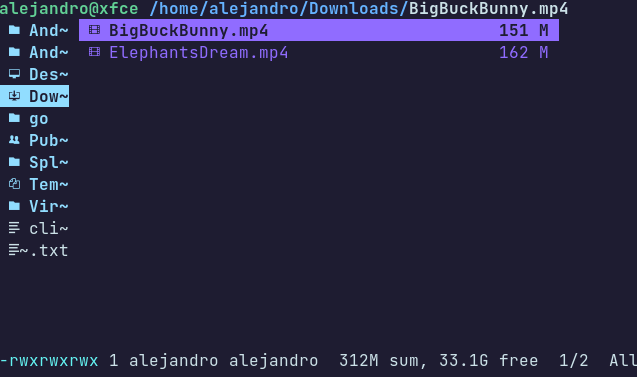

Ranger plugin to get the length of all selected videos

## How to use

Hover over a video or directory or select them in visual mode and use `:vidlength`

## Installation

Clone this repository and copy `videolength.py` to `~/.config/ranger/plugins/`

```
cp vidlength.py ~/.config/ranger/plugins/vidlength.py
```
